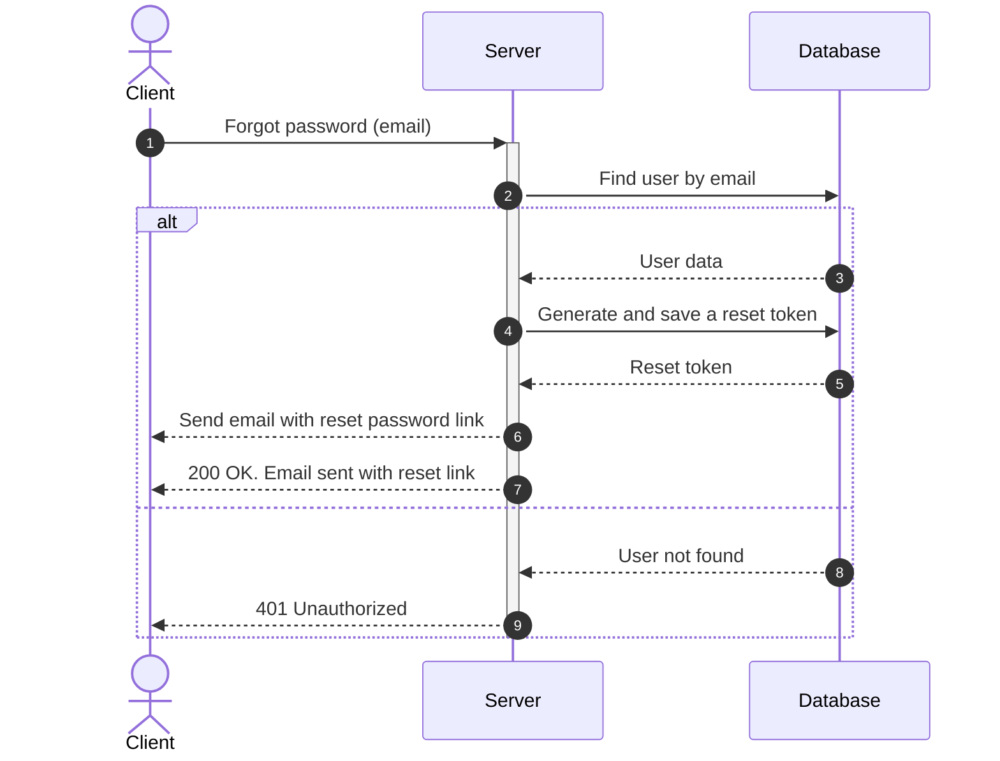
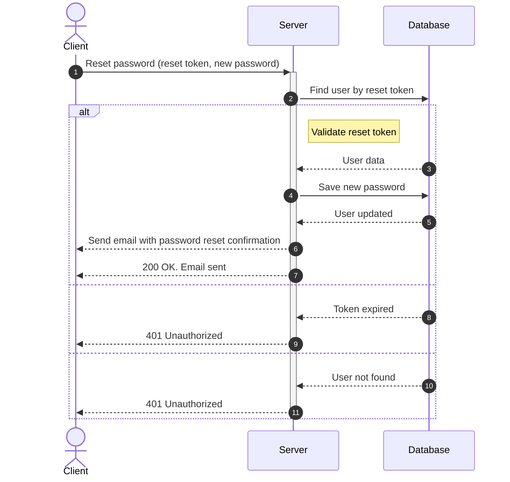

# Forgot password process diagram

UI flow: <https://www.checklist.design/flows/password>

## Forgot password flow

```mermaid
sequenceDiagram
    autonumber
    actor C as Client
    participant S as Server
    participant Db as Database
    C->>+S: Forgot password (email)
        S->>Db: Find user by email
        alt
          Db-->> S: User data
          S->>Db: Generate and save a reset token
          Db-->>S: Reset token
          S-->>C: Send email with reset password link
          S-->>C: 200 OK. Email sent with reset link
        else
          Db-->> S: User not found
          S-->>C: 401 Unauthorized
        end
    deactivate S
```

## Reset password flow

```mermaid
sequenceDiagram
    autonumber
    actor C as Client
    participant S as Server
    participant Db as Database
    C->>+S: Reset password (reset token, new password)
        S->>Db: Find user by reset token
        alt
          Note right of S: Validate reset token
          Db-->> S: User data
          S->>Db: Save new password
          Db-->>S: User updated
          S-->>C: Send email with password reset confirmation
          S-->>C: 200 OK. Email sent
        else
          Db-->> S: Token expired
          S-->>C: 401 Unauthorized
        else
          Db-->> S: User not found
          S-->>C: 401 Unauthorized
        end
    deactivate S
```
