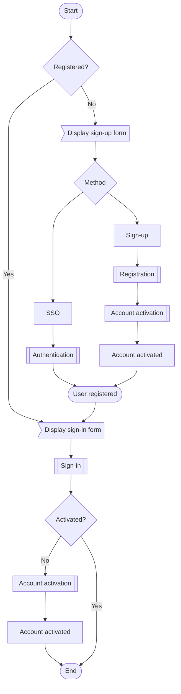

# User registration process flow chart

## TODO

- [ ] Add auth entity for storing user authentication method with following fields:
  - user
  - active
  - method
  - provider
  - [ ] Add loginSocial and registerSocial method for social authentication
- [ ] Return user object with system fields (createdAt, updatedAt, activated, enabled etc) only for admin and super admin from login, activate and register methods
