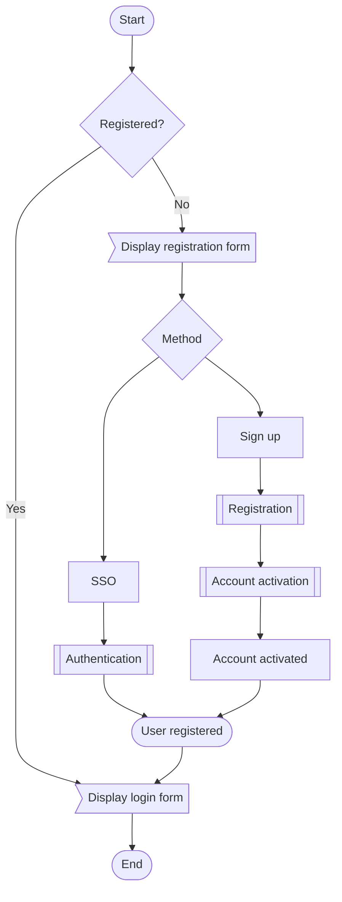

# User registration process flow chart

```mermaid
flowchart TD
    A([Start]) --> B{Registered?}
    B --> |Yes| C1>Display login form]
    B --> |No| C2>Display registration form]
    C2 --> D{Method}
    D --> E[Sign up]--> F1[[Registration]] --> E1
    D --> F[SSO] --> F2[[Authentication]] --> H
    E1[[Account activation]] --> G --> H
    G[Account activated]
    H([User registered]) --> C1
    C1 --> K([End])
    
```
